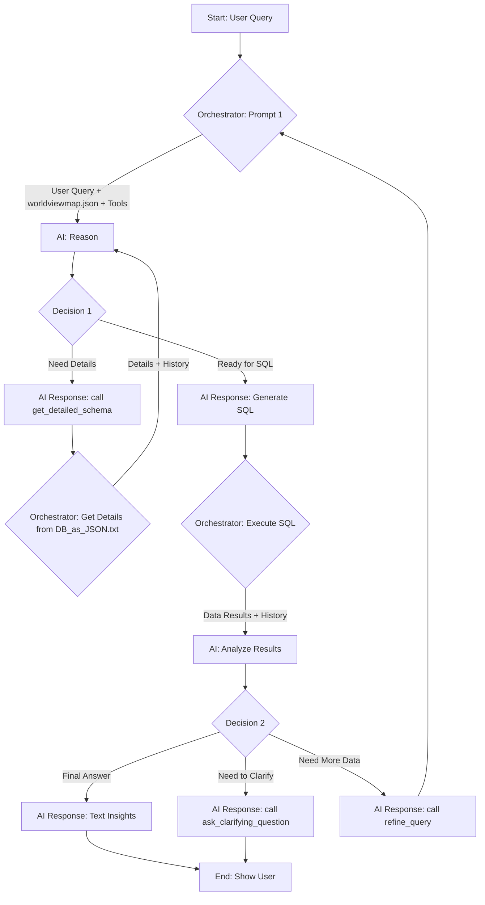

# Design Document: Agentic Architecture for Noor Chat

## 1. Overview & Goals

This document outlines the architecture for evolving the Noor Chat data assistant from a single-shot query generator into a cyclical, multi-turn **"Reason and Act" (ReAct) agent**.

The current architecture involves sending a large, detailed schema to the AI in a single prompt. This is inefficient, costly, and does not allow for complex, multi-step analysis.

The new agentic architecture will address these issues with the following goals:

- **Increase Query Accuracy:** By providing a business logic map and allowing the AI to request details, we enable more precise and context-aware query generation.
- **Enable Complex Analysis:** The agent can now perform multi-step queries, correlate data, and refine its approach based on intermediate results.
- **Drastically Reduce Prompt Size & Cost:** The initial prompt is now a compact, high-level map, with detailed information loaded only as needed.
- **Improve Robustness & Error Handling:** The agent can identify ambiguous questions and invalid requests, asking for clarification instead of hallucinating.

## 2. Core Components

The new architecture is powered by three key data assets:

1.  **`worldviewmap.json` (The Business Logic Graph):** This is a compact, high-level representation of the database. It contains nodes (tables), edges (valid relationships), and pre-defined `chains` of analysis. **This will be sent to the AI in the first turn of every interaction.**
2.  **`DB as JSON.txt` (The Detailed Schema Repository):** This is the full, 194KB detailed database schema. The **application** will hold this in memory and use it as a local database to serve the AI's requests for column-level details. **It will never be sent to the AI in its entirety.**
3.  **`DB as JSON_Short.txt` (The Structural Summary):** A medium-detail view containing table names, keys, and relations. This can be used when the AI needs a broader structural overview without full column details.

## 3. The Agentic Loop (The "Step Protocol")

The core of the new design is a cyclical loop managed by the application's orchestrator function (`naturalLanguageQuery` in `/api/query/route.ts`). The orchestrator guides the AI through the `step_protocol` defined in `worldviewmap.json`.

## 4. Code Implementation Plan

The following changes will be made to the existing codebase:

-   **`src/lib/database/query-engine.ts`:**
    -   **REMOVE:** Old `getDatabaseSchema`.
    -   **ADD:** `loadSchemaAssets()` to read the JSON files into memory.
    -   **ADD:** `getDetailedSchemaFromRepository(tables)`.
-   **`src/app/api/query/route.ts`:**
    -   **REFACTOR:** `naturalLanguageQuery` to be the main orchestrator, containing the state machine/loop logic described above.
-   **`src/app/api/chat/route.ts`:**
    -   Will mostly remain the same, but will now receive final answers or clarifying questions from the `query` route.
-   **New File:** `src/lib/ai-tools.ts` (or similar) to formally define the functions/tools we will expose to the AI (e.g., `get_detailed_schema`, `ask_clarifying_question`).

## 5. Test Scenarios

The following scenarios will be used to validate the implementation.

#### A) Process Adherence Tests

-   **Test 1.1: Two-Step Query (Happy Path)**
    -   **User Input:** "What is the name and status of projects related to 'Change Adoption'?"
    -   **Expected Behavior:**
        1.  Orchestrator sends prompt with `worldviewmap.json`.
        2.  AI responds with a tool call: `get_detailed_schema(tables: ['ent_projects', 'ent_change_adoption', 'jt_ent_projects_ent_change_adoption_join'], reason: '...')`.
        3.  Orchestrator retrieves details for those three tables from `DB as JSON.txt` and sends them back to the AI.
        4.  AI responds with the final, correct `JOIN` query.
        5.  Orchestrator executes the SQL and passes the results for final analysis.

-   **Test 1.2: Cyclical Refinement**
    -   **User Input:** "Show me all risks."
    -   **Expected Behavior:**
        1.  AI generates a `LIMIT 100` query.
        2.  Orchestrator executes and sends back the 100 results.
        3.  In the analysis step, the AI sees the result is incomplete.
        4.  AI responds with a tool call: `ask_clarifying_question(question: 'I found a large number of risks. To provide a more specific answer, please specify a risk category or score range.')`.
        5.  Orchestrator presents this question to the user.

#### B) Quality & Hallucination Tests

-   **Test 2.1: Invalid Join Request**
    -   **User Input:** "Show me how vendors are related to citizen districts."
    -   **Expected Behavior:** The AI, constrained by the `edges` in `worldviewmap.json`, should find no valid path. It must not hallucinate a join. It should respond with a message like, "Based on the business model, there is no direct relationship between vendors and citizen districts. Could I help you with a different analysis?"

-   **Test 2.2: Ambiguous Question**
    -   **User Input:** "What's the status of our IT?"
    -   **Expected Behavior:** The AI should not guess. It should use the `nodes.ent_it_systems.levels` from the map to ask for clarification. It should call `ask_clarifying_question(question: 'When you ask about IT, are you interested in Main Platforms (L1), System Modules (L2), or specific Module Features (L3)?')`.

-   **Test 2.3: Empty Result Set**
    -   **Scenario:** A valid query is generated (e.g., for projects in a year where none exist), and it returns no data.
    -   **Expected Behavior:** The AI, in the final analysis step, must not invent an answer. It should respond clearly: "The query ran successfully but returned no results. This indicates there are no projects matching your criteria for the specified period."

